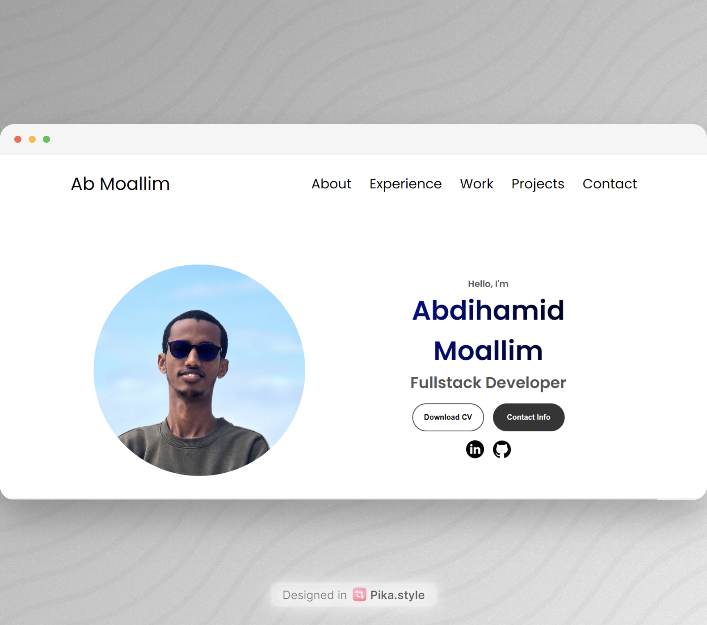

# Abdihamid Moallim's Portfolio

Welcome to the source code of my personal portfolio website! This project showcases my professional journey, skills, and projects in a clean and responsive design.

## 🌟 Tech Stack

- **HTML**: Markup language for structuring the content of the web pages.
- **CSS**: Styling language used to style the web pages.
- **JavaScript**: Scripting language used to add interactivity to the web pages.
- **Responsive Design**: Ensures the website looks great on all devices, from desktops to mobile phones.

## 📜 License

This project is licensed under the MIT License. Feel free to use, copy, modify, and distribute this software and its documentation for any purpose.

## 🔗 Original Source

This project is based on the portfolio tutorial from [Ade-mir](https://github.com/Ade-mir/html-css-js-portfolio-tutorial-2).

## 🌐 Deployed Version

You can visit the live version of my portfolio at [abmoallim.com](https://abmoallim.com).

## 🚀 Getting Started

### Prerequisites

You need a web browser to view the portfolio website. If you want to make modifications, you'll need a text editor and optionally a local web server for development.

### Installation

1. Fork the repository:

   Go to [abmoallim/abmoallim](https://github.com/abmoallim/abmoallim) and click the "Fork" button in the top right corner.

2. Clone your forked repository:

   ```bash
   git clone https://github.com/your-username/abmoallim.git
   ```
3. Navigate to the project directory:
    ```bash
    cd abmoallim
    ```
4. Open index.html in your web browser to view the portfolio.

### Usage
Feel free to modify the content and styles to suit your own needs. All the main sections of the portfolio are located in index.html, and styles are located in style.css and mediaqueries.css.

### Deployment
To deploy the website, simply upload the contents of your project directory to your web server or hosting provider or simply use GitHub Pages to deploy your website.

### 🤝 Contributing
If you find any issues or have suggestions for improvements, please feel free to open an issue or submit a pull request.

### 📬 Contact
You can reach me via [LinkedIn](https://www.linkedin.com/in/abmoallim/).
